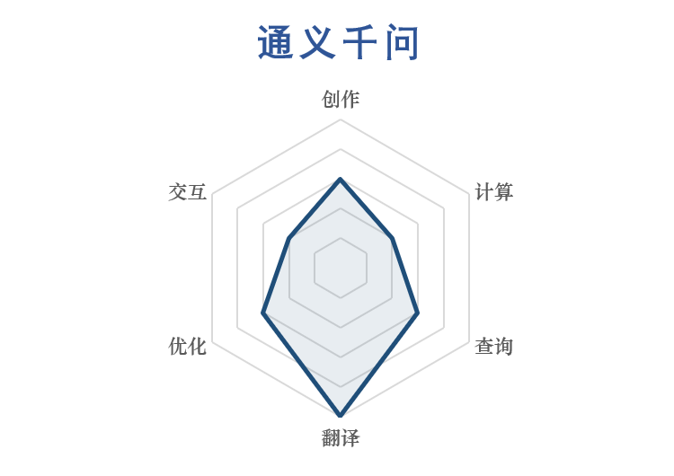
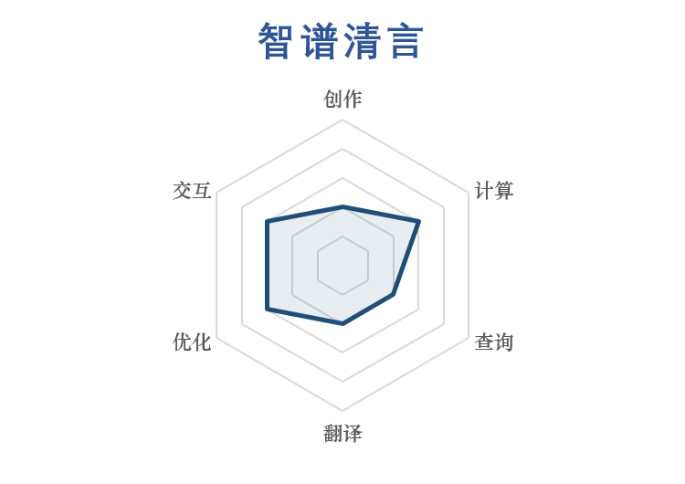

# 面向大学生的“生成式AI+学习”攻略

六个大一小登围绕大学生的AI辅助学习研究申请了一个SQTP项目，现在总结了一套AI使用的推荐，作为学习交流分享出来。当初做这个项目是想要从大学生的角度来看看各个AI的优势劣势，免去大家一个一个尝试的时间精力。没有广告（我们也没接广告的能力），放心食用。其中内容不具备深入原理的专业性，仅仅是通过问答体验得出的结论，所以仅供参考，也欢迎大家分享自己用AI时的心得体会。

  

内容包括两个部分，第一个部分是对于一般AI的提问攻略，第二个部分是对于国内主流AI的测评分析。我们选择了Kimi，豆包，Deepseek，通义千问，讯飞星火，智谱清言，文心一言这七个国内主流AI。测评时间从2025年1月到2025年3月。我们分查询、计算、翻译、创作、优化、交互六大方向对上面提到的AI进行测评。

  

## 提问攻略

  

可以通过以下三大类方法来提高AI提问的可用性。

  

1. 提供限定

2. 多次提问

3. 交叉验证

  

### 提供限定

  

提供限定是针对一个AI的一个对话来说的，限定可以来自以下方面：

  

1. 场景提示：所属学科、我已掌握的知识、AI的身份等

2. 语言风格要求：简明、口语化、详尽等

3. 格式要求：写成一段（不要分点）、以表格呈现、用是或否来回答、字数限制等

4. 要求按照某种模型来输出（如STAR，SWOT，金字塔原则）或按照自己给的模板、结构来输出

5. 要求使用某些领域的知识来回答

6. 要求基于上传文件或网址回答

  

### 多次提问

  

多次提问是针对同一个AI来说的，包括三个方面：

  

1. 同一个对话进行多轮问答，要求改进

2. 新建对话进行提问，比较AI回答是否有偏差

3. 比对开关联网搜索模式的AI回答

  

### 交叉验证

  

交叉验证指的是当前提问AI之外的信息，包括两个方面：

  

1. 打开其他的AI进行提问，比对回答

2. 查看源网页、源文献内容，确保AI没有造假

  

## AI测评

究极省流：Deepseek和豆包是最佳选择。豆包有量，Deepseek有质。豆包快，Deepseek慢。豆包能看见，Deepseek看不见。想聊天找Deepseek。做PPT找Kimi。

### 各AI评价

#### Deepseek

Deepseek在各个方面表现强势，在风格化文本生成和优化、主题调研、求解题目、中英互译、日常互动等方面表现优异，在国产大模型属于版本T0，超大杯，强烈推荐使用。它的回答相比其他AI更为精简，不适合水字数，而适合生成实用内容。它的语言风格丰富，容易让人眼前一亮。然而它也有不足，主要集中在以下方面。Deepseek不擅长图象处理，对于上传的图象只能提取文字，无法“看见”图片内容；Deepseek生成速度较慢，通常只能进行一次问答，在进行第二次问答的时候容易出现服务器繁忙。通过使用腾讯元宝等第三方平台，一定程度上可以规避第二个问题。

#### 豆包

豆包在测评中是表现仅次于Deepseek的AI，在文本创作和优化、内容查询等方面表现不错，写作能力是豆包的强项。豆包适合用于水字数的任务，比如进行规范文字的写作。豆包综合表现略逊于Deepseek，但是胜在生成速度快、具备图象分析能力，综合能力较强，大杯上。

#### Kimi

Kimi总的来说表现中规中矩，属于是“能用”类型，没有太亮眼的表现，大杯中。在数学题目求解方面，Kimi表现较好。值得一提的是Kimi是目前PPT生成的最佳选择，其PPT助手不仅免费而且PPT生成能力与其他支持PPT生成的AI持平。Kimi的生成速度略低于豆包，高于Deepseek，且具备“视觉”，处理一般任务是足够的。

#### 通义千问

通义千问表现一般，略低于Kimi，在文本生成和优化上没有优势，在交互过程中不够人性化，只是在文言文翻译方面略有优势，综合实力较为一般，中杯，不推荐使用。

#### 文心一言

文心一言表现中规中矩，文本生成能力不突出，但是概括能力较强，交互过程中较为人性化，可以体验，大杯下。

#### 讯飞星火

讯飞星火表现一般，文本生成和优化能力一般，不擅长复杂题目的求解和查询内容，PPT生成功能需要收费，不推荐使用，中杯。

#### 智谱清言

智谱清言表现较差，文本生成、查询、交互、题目求解能力均表现不佳，输出过程可能会出现卡顿，PPT生成能力与Kimi相同却要收费，体验不尽如人意，中杯，不推荐使用。

### 各任务评价

#### 创作

对于提问简略的调研任务，豆包以丰富详实的内容表现最佳，而Deepseek以独特的“先思考再生成”的模式位列第二，kimi、通义千问、讯飞星火、文心一言表现均中规中矩，没有亮眼的地方，而智谱清言仅仅概括了网络资料，完成度差，不推荐使用。

对于提问详细的调研任务，Deepseek出色地完成了关键信息地整理，关注到了提问的诉求并给出了实在的建议，最推荐使用。讯飞星火相较其他AI有侧重地加大了关键内容的比重，略胜一筹。而其他AI表现平庸，未能很好地完成任务。

对于提问简略的文案写作任务，Deepseek、文心一言、讯飞星火形式较为新颖，其中Deepseek考虑得最为周到，最推荐使用；讯飞星火有emoji无法正常复制问题，是扣分项。Kimi，豆包等其他AI相对古板，吸引力不足。

对于提问详细的文案写作任务，Deepseek表现最佳，语言风格突出，非常吸引人。其他AI表现大差不差，相对平庸。

对于PPT制作任务，kimi、智谱清言和讯飞星火是调查范围内真正能生成PPT文件的AI。kimi和智谱清言的PPT制作程序是同一个，但kimi不收费，智谱清言要收费，推荐使用kimi。讯飞星火同样要收费，且效果并没有超过kimi和智谱清言，不推荐使用。

对于代码写作任务，豆包、Deepseek、通义千问创作的代码运行速度较快，位于第一梯队。文心一言和讯飞星火的代码运行速度较慢，位于第二梯队。Kimi和智谱清言的代码无法运行，位于第三梯队。

#### 计算

对于高等数学计算题，kimi表现最佳，解答正确且速度快。Deepseek思考时间较长，但能解出正确答案且过程严谨。其余AI面对简单问题能够解答，但是面对困难问题容易犯错，部分AI如讯飞星火甚至无法纠错，不推荐使用。

对于高等数学证明题，各AI均能做出来，其中豆包表现最好，采用方法较好且输出较快。其余AI大多表现尚可，但智谱清言输出过程中的卡顿让人体验不佳，不推荐使用。

对于excel表格的数据分析，呈现出了明显两极分化的分布。其中豆包、智谱清言、文心一言表现较好，基本可以根据上传文件的内容完成统计任务。而Deepseek、讯飞星火、通义千问和kimi无法正确处理上传的excel表格。

#### 查询

对于时事查询，Deepseek表现最佳，细节丰富，要点全面。豆包排名第二，丰富度略逊于Deepseek。其余AI提供的信息不足，相对较差

对于通识查询，豆包表现最佳，内容全面，通俗易懂。Deepseek排名第二，因为缺少例子略逊于豆包。其余的AI大多会遗漏细节。

对于抗干扰能力测试，Deepseek、kimi、豆包和通义千问能识别出提问中的错误，其中Deepseek提供的结果最令人满意。其余的AI未能发现提问中的错误，在该项测试中表现差。

#### 交互

在情感感知和回应方面，Deepseek表现最佳，可以识别并回应幽默等复杂的情感，而智谱清言和文心一言可以理解相对复杂的情感，但是缺乏恰当的回应。讯飞星火、kimi和豆包只能识别基本情绪，不能理解如幽默等复杂情绪。而通义千问体验最为不佳，表现较为生硬刻板，不推荐使用。

在多轮对话连贯性测试方面，kimi和Deepseek表现最佳，对话之间很连贯，而且理解也基本准确。其他AI或多或少会出现不符合要求的回答。

在角色扮演方面，Deepseek碾压其他AI，最为人性化。文心一言和讯飞星火表现相对较好，不会刻意分点回答，较为人性化。豆包在提出不分点的要求之后改正过来，而其他AI非常固执，不能很好代入人类交流的语境。

#### 翻译

在中英互译方面，Deepseek表现最佳，用词地道、逻辑通顺，而豆包可以胜任句子文章的中英翻译，支持对上传文件的全文翻译。Kimi、讯飞星火对一些地道说法的翻译无法保留其韵味。智谱清言的翻译偏向直译，最不通顺。

在古文白话文互译方面，通义千问综合表现最佳，兼顾准确性和语言的优美。通义千问、DeepSeek、讯飞星火注重译文和原文的一一对应，其余的更多是保全意思自由发挥。Kimi、智谱清言、文小言、讯飞星火、DeepSeek在测评过程中出现了实词翻译错误的情况，而豆包和通义千问没有出现。

在图表阅读能力方面，豆包、DeepSeek在提取图表数据的时候，出现了数据错误，导致分析的结果与事实大相径庭，但是有多层级的分析与比较，如果能保证数据提取正确的话，是不错的选择。通义千问与讯飞星火对图表数据的分析层级最多，总结也相对更为全面。

#### 优化

在计算任务优化方面，根据指令条数多少与生成文本的逻辑性、简洁性，DeepSeek > KIMI > 豆包 > 讯飞星火 ≈智谱请言≈通义千问 > 文心一言

在文本优化方面，从发现问题和修改、概括、改写这三个方面考察。发现问题和修改的能力排序是豆包≈DeepSeek>KIMI>讯飞星火≈文心一言≈智谱请言≈通义千问。在概括能力方面，DeepSeek的功能最为强大，而文心一言的概括简洁性与逻辑性较好。豆包中规中矩，其余AI类似“缩句”，概括效果一般。在改写能力方面，Deepseek表现最好，豆包，文心一言和KIMI语言合适和观点比较完善，其他AI的仍有从原文照搬语句的机械感。