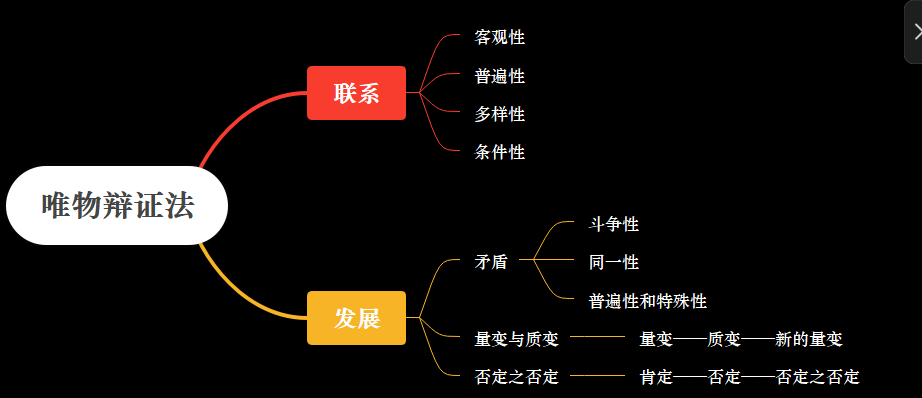
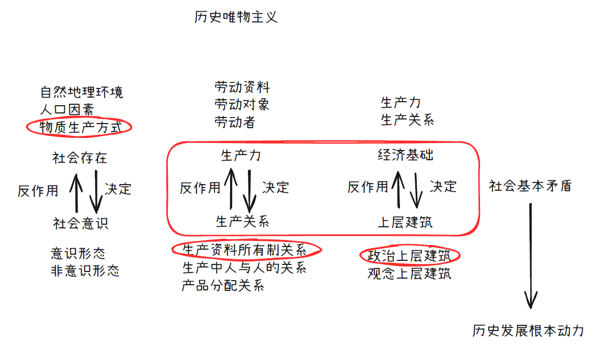
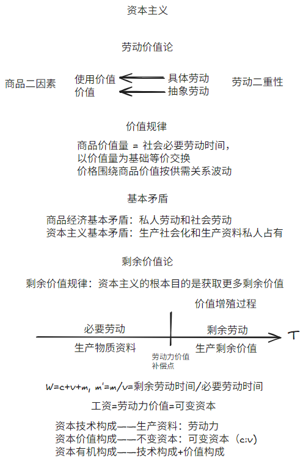

# 马原课本阅读

## 第一章 世界的物质性与发展规律

第一第二章统称辩证唯物主义

### 第一节 世界的多样性与物质统一性

这一节讲马克思主义物质观

#### 思存关系

==思维和存在的关系==（或称物质和意识的关系）问题是哲学的基本问题

一是存在和思维、物质和意识谁为本原的问题，即何者为第一性的问题；对这一问题的不同回答，形成了唯物主义和唯心主义两种根本对立的哲学派别。二是存在和思维、物质和意识是否具有同一性的问题，即思维能否正确地反映存在、人能否认识或彻底认识世界的问题；对这一问题的不同回答，产生了可知论和不可知论的理论。

#### 物质观

马克思认为物质不依赖人类意识存在，可以被感觉到，具有客观实在性。他认为主观世界从属于客观世界，意识是客观世界的主观映像。==物质决定意识，意识对物质有反作用==（能动作用）。

**物质**的根本属性是运动，运动是绝对的，静止是相对的

==既要尊重客观规律，也要发挥主观能动性。尊重客观规律是发挥主观能动性的前提，充分发挥主观能动性，才能正确认识和利用客观规律。==

发挥人的主观能动性需要①从实际出发，②通过实践，③依赖物质条件和物质手段

世界的*物质统一性原理是辩证唯物主义最基本、最核心的观点，是马克思主义的基石*。这个物质统一性原理体现在自然界是物质的，具有客观实在性，人类社会也是物质的，意识统一于物质。

### 第二节 唯物辩证法

这一节讲唯物辩证法

唯物辩证法认为，==世界上的万事万物都处于普遍联系之中，普遍联系引起事物的变化发展==。**联系**和**发展**的观点是唯物辩证法的总观点。

但是题目要求唯物辩证法，应当写的更多（把整个辩证唯物主义都写上），把物质观认识论也都写上，答错不扣分。

#### 联系

**联系**具有客观性、普遍性、多样性、条件性。

#### 发展

==唯物辩证法==揭示了事物变化**发展**的一般规律，即==对立统一规律、量变质变规律和否定之否定规律==，其中对立统一规律是根本规律。

对立统一是**矛盾**的两个属性。对立属性（又称斗争性）在于相互排斥，互相分离；统一属性（又称同一性）在于相互依存，可以相互转化。

**矛盾**具有普遍性（哪里都有）和特殊性（具体情况具体分析）。

量变体现连续性，质变体现中断。量变是质变的必要准备，质变是量变的必然结果，质变后是新的量变。“量变——质变——新的量变”。

事物内部都存在肯定因素（维持事物存在）和否定因素（促进事物灭亡），经过肯定——否定——否定之否定（扬弃）。否定之否定就是取其精华去其糟粕，批判性继承。

==唯物辩证法==还包含一些成对范畴：内容与形式，本质与现象，原因与结果，必然与偶然，现实与可能。

分析这五个范畴就用矛盾的两个特性，即斗争性和同一性，说它们相互区别，又相互依存和转化

任何事物都是内容与形式的统一。内容是事物存在的基础，对形式具有决定作用；形式对内容具有反作用。

本质与现象是相互区别的，本质稳定现象多变，本质内含现象外显。本质与现象又是相互依存的，本质决定现象，现象表现本质。

原因与结果是相互区别的，原因与结果是相互依存和相互转化的。

## 第二章 实践与认识及其发展规律

***实践**的观点是马克思主义的基本观点*
  
人与世界的关系主要包括两个方面：一是认识世界，二是改造世界。那么，人为什么要认识和改造世界，能否认识和改造世界，怎样认识和改造世界？从哲学上讲，这就是实践与认识及其相互关系的问题，真理与价值及其相互关系的问题，就是马克思主义的==实践观==、==认识论==和==价值论==要解决的问题。

### 第一节 实践与认识

#### 实践

用我自己的话来说，**实践**的必须要素是①人类，②目的是改造物质，③按目的影响到了自身之外的物质（隐性规定：是“正确”的事情）

**实践**是人类能动地改造世界的社会性的物质活动，具有客观实在性、自觉能动性和社会历史性三个基本特征。

客观实在性：首先，构成实践活动的诸要素，即实践的主体、客体和中介，都是可感知的客观实在；其次，实践的水平、广度、深度和发展过程，都受着客观条件的制约和客观规律的支配；最后，实践能够引起客观世界的某种变化，可以把人脑中观念的存在变为现实的存在，给人们提供现实的成果。实践的这一特征，把它同人的主观认识活动区别开来。

自觉能动性：与动物本能的、被动的适应性活动不同，人的实践活动是一种有目的、有意识的活动。目的性是能动性的主要表现。人的实践活动结束时得到的结果，在这个过程开始时就作为目的在实践者头脑中以观念的形式存在着，目的决定着实践者的行为。

**实践**的主体、客体和中介是实践活动的三项基本要素。

**实践**主体是人。实践客体是和实践主体互动的客观存在事物，有物质的也有精神的。实践中介包含身体的延展和语言。

主体客体化是主体改造客体（主体的一部分进入了客体），客体主体化就是客体影响主体（客体成为主体的一部分）

**实践**分为物质生产实践、社会政治实践、科学文化实践

==**实践**是**认识**的基础，实践在认识活动中起着决定性的作用==

==**实践**和**认识**的关系：==

1. 实践是认识的来源（做了就知道了）
2. 实践是认识发展的动力（做了之后会想更多）
3. 实践是认识的目的（学知识是为了将来能用上）
4. 实践是检验认识真理性的唯一标准

#### 认识

人的**认识**过程是一个在实践基础上不断深化的发展过程，既表现为实践基础上由感性认识到理性认识，再从理性认识到实践的具体认识过程；又表现为从实践到认识，再从认识到实践的循环往复和无限发展的总过程。

唯心主义认为认识是：生来就有，不断回想

旧唯物主义认为认识是：被动接受，感性直观

==辩证唯物主义认识论==认为认识的本质是主体在实践基础上对客体的能动反映。

**认识**具有反映特性和创造特性。反映特性就是以客观事物为原型，创造特性就是结合自己需要创造客体的理想形态和功能，二者不可分割。

人的**认识**是反映性（或称摹写性）与创造性的统一。只坚持认识的反映性，看不到认识能动的创造性，就重复走上了旧唯物主义直观反映论的错误之路；相反，只坚持认识能动的创造性，使创造性脱离反映论的前提，就会把创造变成主观随意，从而滑向唯心主义和不可知论。

==认识事物的过程是从实践到认识，再从认识到实践==（两个飞跃）

从实践到认识是从感性认识（感官，直观）到理性认识（概念、判断、推理）的过程，需要经过调查和加工，其中也存在非理性因素（联想、猜测、灵感等）

从认识到实践是必要的，因为认识世界的目的是改变世界，且认识的真理性只有在实践中才能得到检验和发展。

从认识到实践需要确定实践目的、实践理念、实践方案、小规模试验等，最后一个环节是对人民群众进行组织和宣传

认识过程不是完成一次从实践到认识再从认识到实践就结束，而是经过多次反复的。（螺旋上升）

### 第二节 真理与价值

#### 真理

==马克思主义真理观==认为真理是客观的。真理的客观性指真理的内容是对客观事物及其规律的正确反映。

==客观性是真理的本质属性，但是真理的形式又是主观的。==某一认识成为真理的决定性条件，并不在于它采取何种主观形式，而在于它能正确地反映对象的本质和规律。既不能因为真理的客观性而把真理等同于客观实在，也不能因为真理具有主观形式而把真理误认为主观产物。

“有用即真理”被认为是主观唯心主义表述。考试语境下的真理具备“正确”特征。

真理具有一元性，同一条件下只有一个真理，但是可以用多样的语言来表达（等价条件）

==真理具有绝对性和相对性。==绝对性指主观和客观相符合，而且世界可知；相对性指一定条件下对真理的认识是有限的。

谬误是和客观事物及其发展规律相违背的认识。真理和谬误作为矛盾对立统一，可以相互转化

#### 价值

价值是是客体对主体所具有的意义。

价值由主体和客体的特性共同决定。

价值的特性包括

1. 主体性（效用）
2. 客观性（属性）
3. 多维性（多种效用）
4. 社会历史性（效用发掘）

价值观是人们关于应该做什么和不应该做什么的基本观点。

### 第三节 认识世界和改造世界

自由是指人在活动中通过认识和利用必然（客观规律）所表现出的一种自觉自主的状态。

==认识世界和改造世界要==

1. 一切从实际出发（认识路线）
2. 实事求是（思想路线）
3. 解放思想（思想和实际相符）
4. 守正创新

---

## 第三章 历史唯物主义（人类社会及其发展规律）

这一章讲==历史唯物主义==，历史唯物主义又称唯物史观

### 第一节 人类社会的存在与发展

#### 社会存在与社会意识

唯心史观：社会意识决定社会存在

唯物史观：社会存在决定社会意识

生产力发展推动生产关系（经济基础）变革，经济基础改变导致上层建筑（制度思想体系）改变

社会存在是指社会物质生活条件，是社会生活的物质方面，主要包括自然地理环境、人口因素和物质生产方式（生产力和生产关系）。

社会意识有不同的分类，从主体角度可以分为个体意识和群体意识，从层次深浅可以分为社会心理（感性认识为主）和社会意识形式（理性认识为主）。

社会意识形式有意识形态和非意识形态之分。意识形态是指反映一定经济关系、政治关系，以及一定阶级或社会集团利益和要求的思想体系，是社会意识诸形式中构成观念上层建筑的部分，通常包括政治法律思想、道德、艺术、宗教、哲学等，政治法律思想是核心。自然科学和语言学、形式逻辑等一部分社会科学不具有社会经济形态和政治制度的性质，不反映特定社会集团的利益和要求，不服务于特定经济政治制度和特定阶级，因而属于非意识形态。

==社会存在决定社会意识，社会意识是社会存在的反映，并反作用于社会存在。==

社会意识具有相对独立性，体现在：①社会意识与社会存在发展不完全同步，也就是有进步和落后之分。②社会意识相互影响，有历史继承性。③社会意识对社会存在有能动的反作用

#### 社会基本矛盾

##### 生产力与生产关系

*生产力与生产关系、经济基础与上层建筑之间的矛盾，是人类社会基本矛盾*

生产力是人类在生产实践中形成的改造和影响自然以使其适合社会需要的物质力量。

生产力的基本要素包括

1. 劳动资料（又称生产资料），劳动资料最重要的是生产工具
2. 劳动对象
3. 劳动者（生产力中最活跃的因素）

说科学技术是第一生产力是因为科学技术上的发明创造，会引起劳动资料、劳动对象和劳动者素质
的深刻变革和巨大进步。

生产关系是人们在物质生产过程中形成的不以人的意志为转移的经济关系。生产关系是社会关系中最基本的关系。

生产关系包括生产资料所有制关系（最基本）、生产中人与人的关系和产品分配关系。

依据生产资料所有制的性质，生产关系区分为两种基本类型。一种是以生产资料公有制为基础的生产关系，其根本特征是：生产资料为劳动者共同占有，人们在生产过程中处于平等地位，在产品分配上不存在剥削。另一种是以生产资料私有制为基础的生产关系，其根本特征是：生产资料归少数剥削者占有，劳动者占有很少或根本没有生产资料，并在生产中处于被剥削地位。

==生产力决定生产关系，而生产关系又反作用于生产力。==这个反作用体现在当生产关系适合生产力发展的客观要求时，对生产力的发展起推动作用;当生产关系不适合生产力发展的客观要求时，就会阻碍生产力的发展。

##### 经济基础与上层建筑

经济基础是指由社会一定发展阶段的生产力所决定的生产关系的总和。

上层建筑是建立在一定经济基础之上的意识形态以及与之相适应的制度、组织和设施。

上层建筑可以分为观念上层建筑（又称意识形态）和政治上层建筑（政治法律制度、设施、组织），政治上层建筑占主导地位。观念上层建筑通常包括政治法律思想、道德、艺术、宗教、哲学等。政治上层建筑包括国家政治制度、立法司法制度和行政制度，以及国家政权机构、政党、军队、警察、法庭、监狱等政治组织形态和设施。

国家是阶级矛盾不可调和的产物。国家的实质是一个阶级统治另一个阶级的工具，是经济上占支配地位
的阶级为维护其根本利益而建立起来的强制性的暴力机关，以保障其在政治上也成为统治阶级。

==经济基础决定上层建筑，上层建筑反作用于经济基础。==

#### 交往与世界历史

交往指在一定历史条件下的现实的个人、群体、阶级、民族、国家之间在物质和精神上相互往来、相互作用、彼此联系的活动。

交往可以分为物质交往和精神交往

交往可以促进生产力发展、促进社会关系进步、促进文化发展和传播、促进人的全面发展

世界历史是指各民族、国家通过普遍交往，打破孤立隔绝的状态，进入相互依存、相互联系的世界整体化的历史。

（资本主义）生产方式的发展变革是世界历史形成和发展的基础，世界历史的形成又反过来促进了生产力的普遍发展和人类的普遍交往。

*普遍交往是世界历史的基本特征。*

#### 社会进步与社会形态更替

社会进步包括社会形态从低级到高级的发展和同一社会形态内部的发展。社会进步促进人的发展和人类解放。

社会形态包括社会的经济形态、政治形态和意识形态。经济形态是社会形态的基础。

社会历史可划分为五种社会形态：原始社会、奴隶社会、封建社会、资本主义社会和共产主义社会。其中，社会主义社会是共产主义社会的第一阶段，又称共产主义社会的初级阶段或低级阶段。

生产力与生产关系矛盾运动的规律性，从根本上规定了社会形态更替的必然性，而社会形态更替也受到人民的历史选择性的影响。

#### 文明及其多样性

文明是人类创造的所有物质成果、精神成果和制度成果的总和，是标志社会进步程度的范畴，反映了人类社会实践活动的积极成果。人类社会发展的过程也是人类文明发展进步的过程。人类文明具有多样性。

### 第二节 社会历史发展的动力

#### 社会基本矛盾

唯心史观：人的精神活动使社会发展

唯物史观：社会基本矛盾使社会发展

==社会基本矛盾是历史发展的根本动力，基本矛盾就是生产力和生产关系、经济基础和上层建筑的矛盾。==

社会基本矛盾规定了社会基本结构。社会基本结构主要包括经济结构、政治结构和观念结构。经济结构有广义和狭义之分。广义的经济结构指生产方式，包含生产力和生产关系两个方面。狭义的经济结构指经济关系或经济制度。这里指的是广义的经济结构。政治结构是指建立在经济结构之上的政治上层建筑，即政治法律制度及设施和政治组织。观念结构中的主要部分是以经济结构为基础，并反映一定社会经济和政治状况的社会意识形态，即观念上层建筑。

社会基本矛盾在历史发展中的作用：

1. 生产力是社会基本矛盾运动中最基本的动力因素，是人类社会发展和进步的最终决定力量。
2. 生产力是社会进步的根本内容，是衡量社会进步的根本尺度。
3. 社会基本矛盾特别是生产力和生产关系的矛盾，决定着社会中其他矛盾的存在和发展。
4. 经济基础和上层建筑的矛盾也会影响和制约生产力和生产关系的矛盾。
5. 社会基本矛盾具有不同的表现形式和解决方式，并从根本上影响和促进社会形态的变化和发展。

#### 社会主要矛盾

社会主要矛盾是处于支配地位，在社会发展过程一定阶段上起主导作用的矛盾。社会主要矛盾是社会基本矛盾的具体体现。

社会主要矛盾的存在和发展，规定或影响着社会非主要矛盾的存在和发展。社会主要矛盾和非主要矛盾相互作用，在一定条件下相互转化。

#### 阶级斗争和社会革命

##### 阶级斗争

阶级斗争是社会基本矛盾在阶级社会中的表现。社会革命是社会基本矛盾所引起的广泛而深刻的社会变革的统称。

*阶级和阶级斗争观点是唯物史观的基本观点。*

阶级就是在社会生产体系中所处的地位不同，同生产资料的关系不同的大型集团。

阶级斗争是阶级利益根本冲突的对抗阶级之间的对立和斗争。阶级斗争对阶级社会发展的推动作用突出地表现在社会形态的更替中。

##### 革命和改革

革命或狭义的社会革命，是阶级斗争的最高形式，其实质是革命阶级推翻反动阶级的统治，用新的社会制度代替旧的社会制度。

革命根源于社会基本矛盾的尖锐化，对社会发展起巨大作用。

改革是一定社会为了解决社会基本矛盾而对生产关系和上层建筑进行的深刻的改变和革新，它是社会制度的自我调整和完善，是同一种社会形态发展过程中的量变和部分质变，是推动社会发展的又一重要动力。改革也属于社会革命。

改革是解决社会基本矛盾、促进生产力发展、推动社会进步的有效途径和手段。

##### 科学技术

科学技术作为先进生产力的重要标志，是推动社会文明进步的重要力量。

科技革命是推动经济和社会发展的强大杠杆，引起生产方式、生活方式和思维方式的变革。

科学技术具有两面性，在生态、伦理、隐私安全、剥削等方面带来了挑战。

正确认识和运用科学技术，首要的就是有合理的社会制度保障科学技术的正确运用，始终坚持使科学技术为人类社会的健康发展服务，让科学技术为人类造福。

##### 文化

文化是推动社会发展的重要力量，为社会发展提供思想指引、精神动力、凝聚力量。

### 第三节 人民群众在历史发展中的作用

唯心史观：英雄史观

唯物史观：群众史观

唯物史观立足于现实的人（社会关系中的人），整体的社会历史过程（历史是群体的历史），社会历史发展的必然性（进步群体推动历史），人和历史关系来得出人民是历史的创造者。

==人民群众是社会历史的主体，是历史的创造者。在社会历史发展过程中，人民群众起着决定性的作用。==

==人民群众是社会物质财富的创造者，社会精神财富的创造者，社会变革的决定力量。==

人民群众是历史的创造者，也不否认个人在历史上的作用。

历史人物是一定历史事件的主要倡导者、组织领导者或思想理论、科学文化的重要代表人物。但不管什么样的历史人物，在历史上发挥什么样的作用，都要受到社会发展客观规律的制约，而不能决定和改变历史发展的总进程和总方向。

用历史分析方法和阶级分析方法来分析历史任务。历史分析方法就是全面客观看到功过，阶级分析方法就是结合历史人物所在阶级来考察。

群众划分为阶级，阶级由政党领导，政党由领袖来主持。

---

## 第四章 资本主义的本质及规律

第四第五章是政治经济学

### 第一节 劳动价值论

自然经济即自给自足经济，不以交换为生产目的。特点是生产力水平低，排斥社会分工，生产规模小。

商品经济是以交换为目的而进行生产的经济形式。产生的条件是存在社会分工和生产资料和劳动产品属于不同的所有者。

#### 商品二因素和劳动二重性

商品具有二因素，分别是使用价值（商品本身及其具有的用途）和价值（积累的无差别劳动），它们之间存在矛盾。

交换价值首先表现为一种使用价值（商品）同另一种使用价值（商品）相交换的量的关系或比例。价值是交换价值的基础。价值是可以量化的

劳动具有二重性，分别是具体劳动（具体工序）和抽象劳动（无差别劳动）。具体劳动创造使用价值，抽象劳动创造价值。

我自己想到的一个例子就是雕刻过程中，雕刻就是具体劳动，然后一点点把这个雕塑给雕出来，就是在生成使用价值（这个雕塑本身）。而这个过程中你的体力条/理智在消耗（我想到了游戏里的机制真是天才），这部分就是抽象劳动，带来价值。

太天才了，我要直接举游戏里的例子。明日之后里面你可以通过砍树来收集木材。木材本身就是使用价值，你砍树的过程就是具体劳动。而你在砍树的时候体力条会下降，这部分是抽象劳动。

#### 商品价值量和价值形式

商品的价值量用社会必要劳动时间来衡量，社会必要劳动时间是在现有的社会正常的生产条件下，在社
会平均的劳动熟练程度和劳动强度下制造某种使用价值所需要的劳动时间。

由此可见，商品价值量是一个状态函数，和过程无关，只和结果有关。可能你要劳动产出一个东西投入了很多，但是价值量不是看你投入了多少，而是按社会平均来看，因此实际算下来价值可能并不如你投入的多。

生产商品所需要的社会必要劳动时间随着劳动生产率的变化而变化。劳动生产率指的是劳动者生产使用价值的效率。影响劳动生产率的因素很多，主要有劳动者的平均劳动熟练程度、科学技术的发展水平及其在生产中的应用程度、生产过程的社会结合、生产资料的规模和效能以及自然条件等。

商品的价值形式当前是货币。货币是在长期交换过程中形成的固定充当一般等价物的商品，是商品经济内在矛盾发展的产物

#### 价值规律

==商品的价值量由生产商品的社会必要劳动时间决定，商品交换以价值量为基础，按照等价交换的原则进行。商品的价格围绕商品的价值按照供求关系波动。==

价值规律的利弊：

1. 自发地调节生产资料和劳动力在社会各生产部门之间的分配比例
2. 自发地刺激社会生产力的发展
3. 自发地调节社会收入的分配
4. 导致社会资源浪费
5. 阻碍技术进步
6. 导致收入两极分化

#### 商品经济的基本矛盾

商品经济以私有制为基础，*私人劳动和社会劳动的矛盾是商品经济的基本矛盾*。

只有交换才能使私人劳动转为社会劳动。有人来买，你生产的商品才被承认有价值，从而解决使用价值和价值之间的矛盾。

在资本主义制度下，私人劳动和社会劳动的矛盾进一步发展成*资本主义的基本矛盾，即生产社会化和生产资料资本主义私人占有之间的矛盾*

### 第二节 资本主义经济制度

创造资本关系的过程，只能是劳动者和他的劳动条件的所有权分离的过程，这个过程一方面使社会的生活资料和生产资料转化为资本，另一方面使直接生产者转化为雇佣工人。

生产资料所有制是指事实上生产资料归谁所有、归谁支配，并凭借这种所有和支配实现生产和获得剩余产品，生产资料所有制性质决定生产关系的性质。

资本家拥有生产资料的所有权，劳动者与生产资料相分离，为了维持生存，劳动者不得不通过将劳动力出卖给资本家来实现与生产资料的结合，资本家与工人的关系变成雇佣劳动关系。

W—G—W，简单商品流通公式，卖出货物是为了换钱来买所需的商品。

G—W—G'，资本总公式，花钱投资是为了卖出去得到更多的钱用于再投资。

劳动力成为商品是资本增值的原因。

劳动力是指人的劳动能力，是人的脑力和体力的总和。

劳动力成为商品需要①劳动者在法律上是自由人，能够把自己的劳动力当作自己的商品来支配②劳动者没有任何生产资料，没有生活资料来源，因而不得不依靠出卖劳动力为生。

劳动力的价值包括维持劳动者本人生存所必需的生活资料的价值、维持劳动者家属的生存所必需的生活资料的价值、劳动者接受教育和训练所支出的费用。

我解释一下，重新回顾使用价值和价值的定义而且定义劳动力的价值。A的使用价值就是你能用A来干什么。那么人的使用价值就是人能做到什么，比如说你让一个人去买咖啡、去写一篇文章，这些就是人的使用价值。而A的价值呢，就是形成这个东西耗费的东西。所以人的价值就是把他培养到这个状态以及让他活下来所需要耗费的东西。

#### 剩余价值论

*剩余价值理论是马克思经济学说的核心内容和基石*。

劳动力的使用价值是价值的源泉，在消费过程中能够创造新的价值，而且这个新的价值比劳动力本身的价值（=工资）更大。正是由于这一特点，货币所有者购买到劳动力以后，在消费过程中，不仅能够收回他在购买这种特殊商品时支付的价值，还能得到一个增殖的价值即剩余价值（用m表示）。而一旦货币购买的劳动力带来剩余价值，货币也就变成了资本。

==剩余价值规律：资本主义生产的直接目的和决定性动机，就是无休止地获取尽可能多的剩余价值。==

资本主义生产过程具有二重性，一方面是生产物质资料的劳动过程；另一方面是生产剩余价值的过程，即价值增殖过程。资本主义生产过程是劳动过程和价值增殖过程的统一。

劳动过程是劳动者通过有目的的活动，即运用劳动资料对劳动对象进行加工，改变自然界的物质形态，创造出满足人们某种需要的使用价值的过程。其中包括三个基本要素，即劳动者的劳动、劳动对象和劳动资料。

资本主义劳动过程的特点：①工人在资本家的监督下劳动，他们的劳动隶属于资本家②劳动的成果或者产品全部归资本家所有。

价值增殖过程，是超过劳动力价值的补偿这个一定点而延长了的价值形成过程。雇佣工人的劳动分为两部分：一部分是必要劳动，用于再生产劳动力的价值；另一部分是剩余劳动，用于无偿地为资本家生产剩余价值。价值增殖过程是剩余价值的生产过程，剩余价值是雇佣工人所创造并被资本家无偿占有的超过劳动力价值的那部分价值

在剩余价值生产中有==不变资本==和==可变资本==两类资本。

不变资本是以生产资料形态存在的资本。生产资料的价值通过工人的具体劳动被转移到新产品中，其转移的价值量不会大于它原有的价值量。尽管不同形式的生产资料转移价值的形式有所不同，有的是在一次生产过程中全部转移，如原材料和燃料；有的是在多次生产过程中逐渐转移，如机器、厂房等，但是转移的总是生产资料原有的价值量。以生产资料形式存在的资本在生产过程中只转移自己的价值量，不发生增殖，这部分资本叫作不变资本（用c表示）。

可变资本是用来购买劳动力的那部分资本。可变资本的价值在生产过程中不是被转移到新产品中去，而是由工人的劳动再生产出来。在生产过程中，工人所创造的新价值不仅包括相当于劳动力价值的价值，而且还包括一定量的剩余价值。由于这部分资本的价值是一个可变的量，因此叫作可变资本（用v表示）。

W(商品价值)=c(不变资本)+v(可变成本)+m(剩余价值)

棉布的价值=棉花、厂房、机器的价值+劳动力创造的价值=棉花、厂房、机器的价值+工资+剩余价值（利润）

==剩余价值率==m'=m（剩余价值或称利润）/v（可变资本或称工资）=剩余劳动时间/必要劳动时间

剩余价值生产的方法包含绝对剩余价值的生产和相对剩余价值的生产

绝对剩余价值的生产就是增加工人产出的总价值，通过延长工作时长和提高劳动强度实现。

相对剩余价值的生产就是在必要劳动时间减少的情况下仍然要求你做那么长时间，通过改善技术和管理且不改变工资工时来实现。

剩余价值的资本化，就是资本积累。资本积累不但是社会财富占有两极分化的重要原因，而且是资本主义社会失业现象产生的根源。

资本主义简单再生产就是拿剩余价值消费，不扩大规模。资本主义扩大再生产就是拿剩余价值扩大生产规模。

资本的==技术构成==是由生产的技术水平所决定的生产资料和劳动力之间的比例。资本的==价值构成==是不变资本和可变资本之间的比例。资本的技术构成决定资本的价值构成，而价值构成的变化通常反映技术构成的变化。

资本的==有机构成==等于资本的技术构成+价值构成。资本主义生产追求提高剩余价值，减少可变资本/不变资本，使得劳动力需求减少，造成失业。

资本循环是资本从一种形式出发，经过一系列形式的变化，又回到原来出发点的运动。资本循环包括购买阶段、生产阶段和售卖阶段。持续的资本循环称为资本周转。

社会生产是连续不断地进行的，这种连续不断重复的生产就是再生产。社会再生产的核心问题是社会总产品的实现问题，即社会总产品的价值补偿和实物补偿问题。

在资本主义制度下，工人的工资是劳动力价值，这是资本主义工资的本质。

*生产社会化和生产资料资本主义私人占有之间的矛盾，是资本主义的基本矛盾*。（意思就是本来是全民所有但是变成集中在少数人手里）

资本主义的基本矛盾体现在①生产无限扩大的趋势与劳动人民有支付能力的需求相对缩小的矛盾②单个企业内部生产的有组织性和整个社会生产的无政府状态之间的矛盾。

*生产过剩是资本主义经济危机的本质特征*，但是这种过剩是相对过剩，即相对于劳动人民有支付能力的需求来说社会生产的商品显得过剩，而不是与劳动人民的实际需要相比的绝对过剩。

### 第三节 资本主义上层建筑

资本主义上层建筑包括资本主义的政治上层建筑和观念上层建筑，前者集中体现为资本主义政治制度，后者主要体现为资本主义意识形态。

#### 资本主义政治制度

资本主义国家本质上是资产阶级进行阶级统治的工具。资本主义国家的职能以服务于资本主义制度和资产阶级利益为根本内容，包括对内和对外两个基本方面，即对内实行政治统治和社会管理，对外进行国际交往和维护国家安全及利益。

资本主义国家的政治统治是通过资本主义民主制度实现，资本主义法律制度是资本主义民主制度的重要内容。宪法是资本主义国家法律制度的核心，基本原则包括：私有制原则、主权在民原则、分权制衡原则、人权原则。

资本主义政治制度的进步作用：推动生产力发展、提高人的政治自由、积累了社会管理经验。局限性：民主是金钱操纵的民主，名义平等掩盖事实的不平等、政党制是维护资产阶级统治的政治制度、政党扯皮效率低下。

#### 资本主义意识形态

资本主义意识形态是在资本主义国家中占统治地位、反映了作为统治阶级的资产阶级利益和要求的各种思想理论和观念的总和。其中一以贯之的核心思想，主要是私有制神圣不可侵犯观念和个人主义价值观。

资本主义意识形态的本质是为资本主义国家的政治上层建筑服务的，是资产阶级的阶级意识的集中体现。

资本主义意思形态有进步意义，推动了历史前进，但仍然具有阶级压迫的局限性。

## 第五章 资本主义的发展及其趋势

### 第一节 垄断资本主义的形成与发展

资本主义的发展经历了两个阶段：自由竞争资本主义和垄断资本主义。19世纪70年代到20世纪初是过渡阶段。

自由竞争引起生产集中和资本集中，生产集中和资本集中发展到一定阶段必然引起垄断，这是资本主义发展的客观规律

垄断是指少数资本主义大企业为了获得高额利润，通过相互协议或联合，对一个或几个部门商品的生产、销售和价格进行操纵和控制。

垄断会让竞争更加激烈，因为①垄断没有改变生产资料的资本主义私有制，促进商品经济继续发展（商品经济一定有竞争）②垄断组织为了维持垄断地位继续竞争③不同细分领域之间仍然有竞争

|      | 自由竞争资本主义 | 垄断资本主义       |
| ---- | -------- | ------------ |
| 竞争目的 | 获得超额利润   | 获取高额垄断利润     |
| 竞争手段 | 改进技术降低成本 | 经济手段和非经济手段并用 |
| 竞争范围 | 国内经济市场   | 国际经济和非经济领域   |

金融资本是由工业垄断资本和银行垄断资本融合在一起而形成的一种垄断资本。

金融寡头是指操纵国民经济命脉，并在实际上控制国家政权的少数垄断资本家或垄断资本家集团。

垄断资本的实质在于获取垄断利润，垄断利润是垄断资本家凭借其在社会生产和流通中的垄断地位而获得的超过平均利润的高额利润。垄断利润主要是通过垄断组织制定的垄断价格来实现的。垄断价格是垄断组织在销售或购买商品时，凭借其垄断地位规定的、旨在保证获取最大限度利润的市场价格。

垄断高价就是要求产品的价格高，垄断低价就是要求原料成本低。

国家垄断资本主义是国家政权和私人垄断资本融合在一起的垄断资本主义。国家垄断资本主义是生产社会化程度进一步提高之后需要国家调整帮助私人垄断的结果。

国家垄断资本主义的形式包括：国家所有并直接经营企业，国家与私人共有、合营企业，国家通过多种形式参与私人垄断资本的再生产过程，宏观调节，微观规制。

国家垄断资本主义有提高生产力的积极作用，但没有改变垄断资本主义的性质，仍然加大了剥削，维护统治。

金融自由化与金融创新是金融垄断资本得以形成和壮大的重要制度条件，导致经济脱实向虚

垄断资本向世界输出的原因包括输出过剩产能谋取利润、在别国取得垄断优势。

帝国主义的特征：（1 ）垄断组织在经济生活中起决定作用；（2）在金融资本的基础上形成金融寡头的统治；（3）资本输出有了特别重要的意义；（4）瓜分世界的资本家国际垄断同盟已经形成;（5）最大资本主义大国已把世界上的领土瓜分完毕。

经济全球化是指在生产不断发展、科技加速进步、社会分工和国际分工不断深化、生产的社会化和国际化程度不断提高的情况下，世界各国、各地区的经济活动越来越超出某一国家和地区的范围而相互联系、相互依存的过程。

经济全球化表现为生产全球化、贸易全球化、金融全球化。

经济全球化的原因：科学技术的进步和生产力的发展（根本）、跨国公司的发展提供了适合的组织形式、各国经济体制的变革。

经济全球化的好处包括：提高资源配置效率，促进生产力发展，给发展中国家带来先进技术、就业机会、国际贸易等。坏处包括：加大发达国家和发展中国家的不平等，加剧发展中国家资源短缺和环境污染、增加经济风险。

### 第二节 正确认识当代资本主义的新变化

生产资料所有制的变化：私人资本所有制-私人股份资本所有制-国家资本所有制发挥重要作用，法人资本所有制主导

垄断资本形式的变化

劳资关系和分配关系的变化：控制更加严格，剥削方式更隐蔽，出现了激励制度和福利制度缓和矛盾

社会阶层和阶级结构的变化：企业所有权（资本家）和控制权（高级经理）分离、知识型服务型劳动者增加

经济调节机制和经济危机形态的变化：国家干预-强化市场弱化政府

政治制度的变化：政治制度多元化，公民权利扩大，改良政党力量扩大

变化的原因：科技和生产力发展（根本），工人阶级斗争，社会主义优越性的影响，改良主义政党的改革

大变局中的问题：经济发展失调、政治体制失灵、社会融合机制失效

资本主义的本质没有改变，资本主义生产关系的根本性质没有改变

### 第三节 资本主义的历史地位和发展趋势

资本主义的进步性：

1. 资本主义将科学技术转变为强大的生产力
2. 资本追求剩余价值的内在动力和竞争的外在压力推动了社会生产力的迅速发展
3. 资本主义的意识形态和政治制度作为上层建筑在战胜封建社会自给自足的小生产的生产方式，保护、促进和完善资本主义生产方式方面起着重要作用，从而推动了社会生产力的迅速发展，促进了社会进步

资本主义的局限性：

1. 资本主义的基本矛盾阻碍社会生产力的发展
2. 资本主义制度下财富占有两极分化，引发经济危机
3. 资产阶级支配和控制资本主义经济和政治的发展和运行，不断激化社会矛盾和冲突

==资本主义的内在矛盾决定了资本主义必然被社会主义所代替。==

1. 资本主义有基本矛盾
2. 资本积累推动资本主义基本矛盾不断激化并最终否定资本主义自身
3. 国家垄断资本主义是资本社会化的更高形式，将成为社会主义的前奏
4. 资本主义社会存在着资产阶级和无产阶级两大阶级之间的矛盾和斗争

社会主义代替资本主义是一个复杂的长期的历史过程